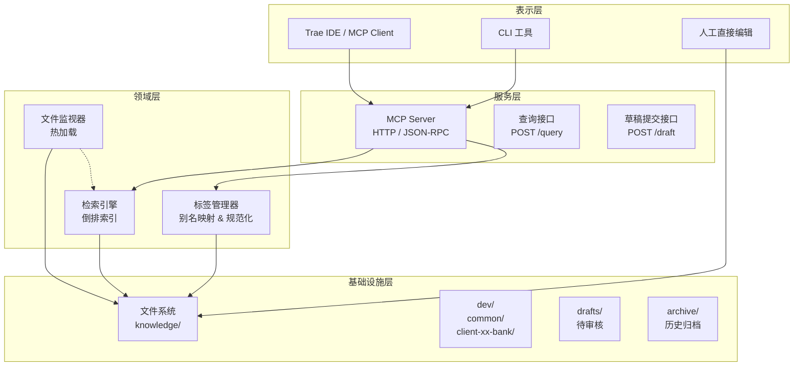

## 🏗️ MVP 架构总览（分层视图）



---

## 📂 目录结构（MVP 版）

```text
knowledge/                  # 根目录（Git 仓库）
├── dev/                    # 唯一领域（MVP 阶段）
│   ├── common/             # 跨甲方通用规则
│   │   └── go-coding-standards.yaml
│   ├── client-xx-bank/     # 甲方定制规则
│   │   └── k8s-deploy-troubleshoot.yaml
│   └── assets/             # Markdown 引用的图片
│       └── 20260628_支付流程图.png
├── drafts/                 # Agent 草稿区（待人工审核）
│   └── test-draft.yaml
├── archive/                # 历史归档（废弃/合并的记录）
├── .tag_aliases.yaml       # 全局标签别名映射表
└── AGENTS.md               # Agent 维护手册
```

---

## 🧩 核心模块职责

### 1. 文件系统读写器（`fs` 包）

- **读取**：启动时递归扫描 `dev/` 下所有 `.yaml` 文件，解析 YAML 头信息 + Markdown 正文。
- **写入草稿**：将新知识写入 `drafts/`，文件名 `{日期}_{标题摘要}.yaml`，状态标记为 `pending_review`。
- **热加载**：通过 `fsnotify` 监听文件变化（新增/修改/删除），自动重载内存索引（无需重启服务）。

### 2. 标签管理器（`tag` 包）

- **规范化**：强制小写 + 中划线（`go-modules`），拒绝空格/下划线/大写。
- **别名映射**：加载 `.tag_aliases.yaml`，如 `go: [golang, go语言]`。检索时自动将变体归一。
- **多维验证**：确保每条记录的标签覆盖 `场景/域/类型/甲方` 四个维度（至少 3 个）。

### 3. 检索引擎（`search` 包）

- **倒排索引**：启动时构建 `map[term][]int`（term → 文档索引列表），term 来自 `tags + title + aliases + content前100字`。
- **查询流程**：
  ```text
  用户输入 "go 服务部署 k8s 超时"
     ↓ 分词（按空格/下划线/驼峰切割）
     ↓ 遍历倒排索引匹配 term（tag / title / content 前 100 字同等计分）
     ↓ 按命中次数排序 → 返回 Top 5
     ↓ 降级策略：若结果 < 3 条，去掉停用词重新匹配
  ```
- **输出格式**：返回 `[{title, content(前200字), tags, filepath, score}]`

### 4. MCP 服务层（`server` 包）

- **协议**：标准 JSON-RPC 2.0 over HTTP。
- **暴露接口**（REST + JSON-RPC 2.0 混合）：
  - `POST /query`：JSON-RPC method `query_knowledge` → 返回 Top 5 结果
  - `POST /draft`：JSON-RPC method `submit_knowledge` → 生成草稿存入 `drafts/`
  - `GET /drafts`：返回所有待审核草稿列表
  - `POST /drafts/approve?path=<filepath>`：审核通过，移入 `dev/` 对应目录
  - `POST /drafts/reject?path=<filepath>`：废弃删除

### 5. 人工审核（`fs.Store` + `server` 包）

> 注意：审核功能实现在 `fs.Store`（文件操作）和 `server` 包（HTTP 路由）中，无独立 `review` 包。

- **草稿列表**：提供接口 `GET /drafts`，返回所有待审核文件列表。
- **确认入库**：提供接口 `POST /drafts/{id}/approve`，将文件从 `drafts/` 移动到 `dev/` 对应分类目录，状态改为 `active`。
- **废弃**：提供接口 `POST /drafts/{id}/reject`，直接删除草稿文件。

---

## 🔧 技术选型（MVP 极简）

| 组件 | 选型 | 理由 |
| :-- | :-- | :-- |
| **语言** | Go 1.26+ | 标准库强大，无依赖部署，适合文件系统操作 |
| **HTTP 框架** | 标准库 `net/http` | MVP 阶段无需第三方框架 |
| **YAML 解析** | `gopkg.in/yaml.v3` | 唯一外部依赖，支持多行文本 |
| **文件监听** | `github.com/fsnotify/fsnotify` | 热加载必须，轻量可靠 |
| **日志** | 标准库 `log` | 简单够用 |
| **测试** | 标准库 `testing` | 覆盖核心检索逻辑 |

---

## 📋 MVP 范围（做什么 & 不做什么）

### ✅ MVP 包含

- 文件系统知识库（纯文本 YAML + Markdown）
- 四维标签（场景/域/类型/甲方）的强制验证
- 倒排索引检索（基于 tags + title + content）
- 标签别名映射（.tag_aliases.yaml）
- MCP 查询接口（`/query`）
- 草稿提交接口（`/draft`）
- 热加载（修改文件后自动生效）
- 人工审核流程（草稿 → 确认 → 入库）

### ❌ MVP 不包含

- 前置文档清洗（MinerU / 其他解析工具）
- LLM 自动提取标签（人工填写 tags，或用外部脚本调用 DeepSeek 批量生成）
- 向量检索 / RAG
- 自动补全 / Hooks
- 用户权限管理
- 多领域（只做 `dev/`，扩展靠新建文件夹）
- Dream 模式自动去重（由 Agent 每周手动触发）

---

## 🚀 部署与运行

```bash
# 1. 克隆知识库
git clone https://git.company.com/knowledge-base.git
cd knowledge

# 2. 编译 Go 服务
go build -o knowledge-server ./cmd/server

# 3. 启动服务（监听 8080 端口）
./knowledge-server -dir ./ -port 8080

# 4. 测试查询
curl -X POST http://localhost:8080/query \
  -H "Content-Type: application/json" \
  -d '{"jsonrpc":"2.0","method":"query_knowledge","params":{"query":"go 服务 k8s 部署失败"},"id":1}'

# 5. 提交草稿
curl -X POST http://localhost:8080/draft \
  -H "Content-Type: application/json" \
  -d '{
    "jsonrpc": "2.0",
    "method": "submit_knowledge",
    "params": {
      "title": "Go 服务 K8s 部署踩坑",
      "content": "## 问题描述\n...",
      "tags": ["场景:部署", "域:Go", "域:K8s", "类型:避坑", "甲方:XX银行"]
    },
    "id": 1
  }'
```

---

## 📊 性能预期（1000 条记录）

- **启动加载**：< 100ms（扫描 + 解析 + 建索引）
- **查询响应**：< 5ms（内存倒排索引 + 排序）
- **热加载延迟**：< 10ms（fsnotify 触发到重载完成）
- **内存占用**：< 50MB（1000 条 \* 平均 5KB 内容）

---

## 💎 架构核心原则

1. **文件系统即数据库**：放弃 SQLite/向量库，所有数据以 YAML 文件存在磁盘，人工可读可编辑。
2. **检索优先于存储**：先设计好用户会怎么问（Query），再设计标签体系（Tags），最后才考虑存储格式。
3. **人在回路**：Agent 只能写 `drafts/`，入库必须人工确认，确保质量。
4. **克制**：不做任何“炫技”功能（向量、重排、自动补全），先跑通最小闭环。
